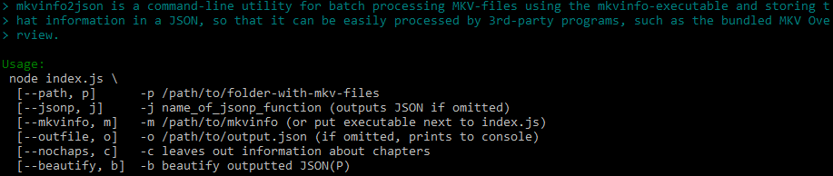
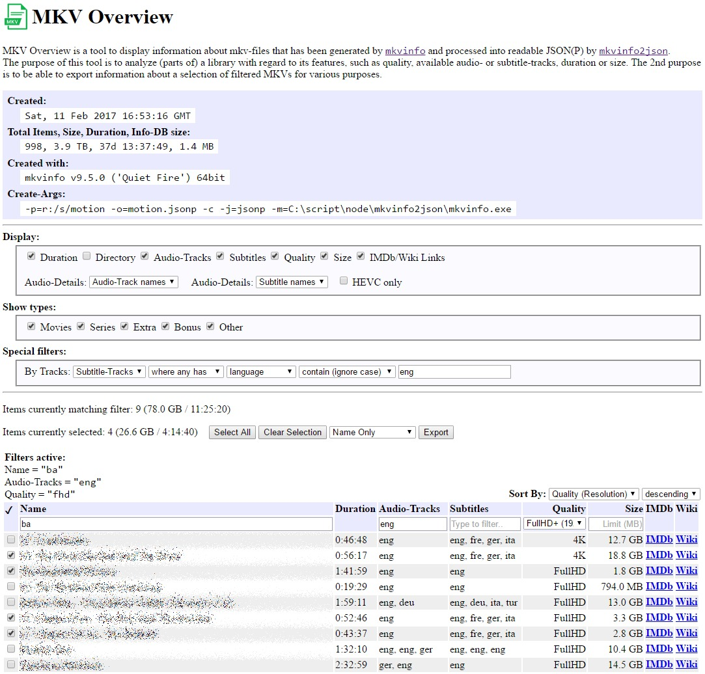

# MkvInfo2Json
`MkvInfo2Json` is a Node.Js-based command-line tool that facilitates the excellent `mkvinfo` to extract meta-information recursively from a directory containing MKV files. It exports this information to `JSON(P)`. The binary for mkvinfo has to be provided. You may place it next to the index.js file or specify the path manually.

## Features
* Recursively scan a directory for MKV files
* Run every file through `mkvinfo` and extract information about audio-/video-tracks, subtitles, duration, chapters, size, resolution, codec etc.
* Output the details to JSON or to JSONP, so that a library can be analyzed offline
* Generate human-readable, beautified JSON

## Command Line

# MKV Overview
`MKV Overview` is a bundled tool to display a JSON(P) file generated by `MkvInfo2Json`. It allows to examine a library, to filter it, and to export meta-information as JSON. It is a stand-alone application that uses angular.js and also works offline (no webserver required).

## How-to
MKV Overview picks up the file `motion.js` (as JSONP) by default. It needs to be placed next to the `index.html` in the web-directory.

## Available filters
* *Type*: A very basic filter that knows the built-in types Movie, Series, Extra, Bonus, Other (assigns this category to an MKV if its pathname contains any of these)
* *Column-Filters*: Most of the columns come with a filter that offers either a pre-selection or uses the typed in text to filter using *contains*
* ***Special***: Used to filter audio-/video-/subtitle-tracks where any/none/all have a specified field that is missing/(not) equal to/(not) contains a value

## Display options
* *Enable/Disable* Duration, Directory, Audio-Tracks, Subtitles, Quality, Size, IMDb/Wiki links
* *Detail Display* is available for audio- and subtitle-tracks. If enabled, shows e.g. type, # of channels etc. Otherwise, just a string that was concatenated from the language of the tracks

## Sorting
There are various filters available to sort the (filtered) results by, such as duration or size, ascending or descending.

## Export metadata
It is possible to select MKVs in the displayed table. MKV Overview always provides a summary of the currently filtered and selected items. The export-function generates a JSON that can be downloaded directly.

The kind of exported information is flexible, e.g. just the name, extended information or the whole entry.

## Example
That is how MKV Overview presently looks. It's neither very pretty nor is it optimized for mobile usage, as the intention behind it was desktop-usage. Pull requests or alternative interfaces welcome!

# History
* **v1.1.3** Small update to fix the non-working filter for subtitles
* **v1.1.2** Contains a schema-definition for the JSON generated/interpreted and uses a JSONP-file with default `.js`-extension by default for better compatibility. Also improved the parsing of `segInfo`-blocks for MKV files. MKV Overview can now display and filter `Head`- and `SegInfo`-blocks.
* **v1.0.0** Initial release
